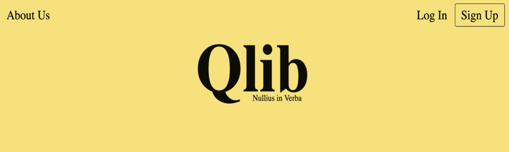
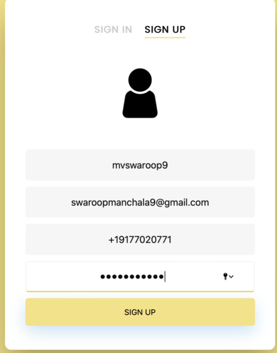
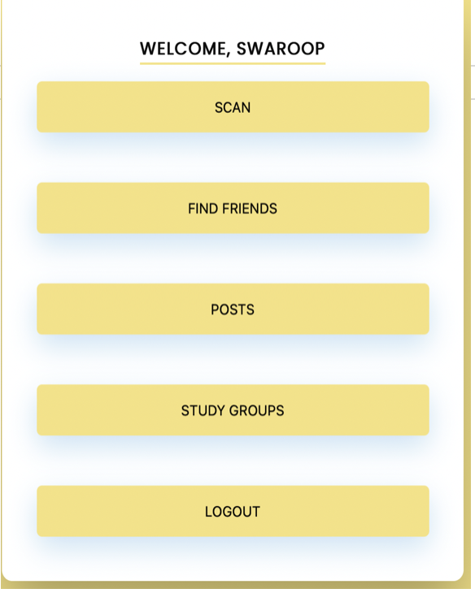
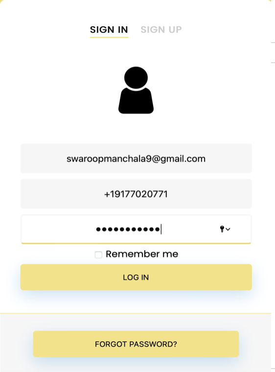

# Qlib
A innovative idea for Library, where people have access to ideas, thoughts and perception of other students with a simple tap.

Q Lib
Swaroop Manchala | Utkarsha Chourasia

Introduction and Brief Description of Proposal

Qlib makes a library as an interactive and intelligent entity. Imagine with a simple scan you gather access to myriad feedback and perceptions on the subject. You can have access to ideas, perceptions and thoughts of an entire subject with a simple tap. Qlib brings out the best in a college learning community, where you can understand other students ideas about a subject or concept from students with different academic backgrounds (Computer Science, Arts, Economics) and experiences. A student can simple scan a library book and the deep learning model returns the book review, comments, explanations, videos, notes posted by other students. And that is limitless.

Working Prototype:

Background/Literature Review

Impact:

Sometimes we feel what other students think of a concept, how do they process it differently based on their experiences and academic background. Such a tool just bridges this gap and lets people explore an ocean of understanding, also builds a conducive environment for innovation. To achieve ambitious 21st century goals and deal with high level complexity its essential to groom students to integrate tools, language and knowledge drawn from different disciplines and sub disciplines. Please refer to this paper in citations section which supports the above claim.

Feasibility:

We are currently working on a prototype to build this tool, it's very feasible as all we need is a running web application and data from users for each book, concept etc. We will also try to demonstrate the web application during the pitch.

User Experience:

We can develop iteratively and keep adding new features into the application. It's usually a simple web application where much of the work is being done in the backend and an easy to use user interface. It does definitely improve the quality of study time in the library and also does greatly impact the understanding of concepts and a chance for combined group study on the topic. Please refer to this paper in citations section
which supports the above claim. It promotes entrepreneurial culture and cross domain application of knowledge.
Methodology and Analysis

Application of Idea:

Its a web application accessible to mobile, laptop, tablet and other devices with internet connection. One can the library book and read and post comments reviews, notes prepared by other students on a particular book, section and concept. The application retrieves all relevant reviews, ideas, thoughts related to the concept mentioned by other people on reading or processing the concept. They can reply to each concept, idea and propose their own.
All users have accounts in the application which helps keep track of their profile which is optional to provide, their reviews and ideas. Each user can connect with one another to form study groups based on their interest on the topic. Meet up and share their ideas over coffee.
We can eventually use this data to understand learning patterns from structured data such as categories, tags, numeric data etc. We can use this data to understand how students process and learn information. We also can recommend study groups using a recommendation engine.
The idea is very feasible to develop and it can easily bring people together to share knowledge. All we need is time and data to get this up and running at a large scale. Using this data we can suggest student to follow other students with similar interest using a similarity index metric.

The Pitch/Conclusion

Education cannot be confined to boundaries and authority, we propose a decentralised way of learning from across disciplines, because a submission to authority is a restriction to freedom, and only freedom can forge a path to truth.
Nullius in Verba ~ Take no one’s word for it.

Citations and Image Attributions

https://www.sciencedirect.com/science/article/pii/S187167842030176X
